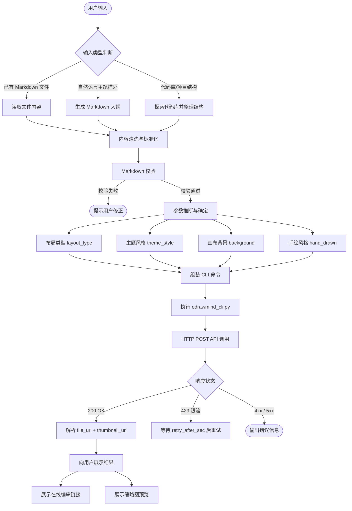
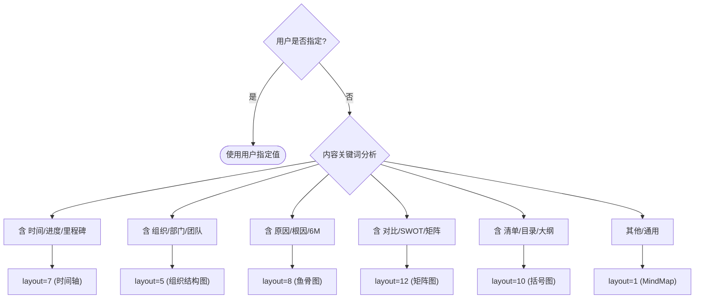
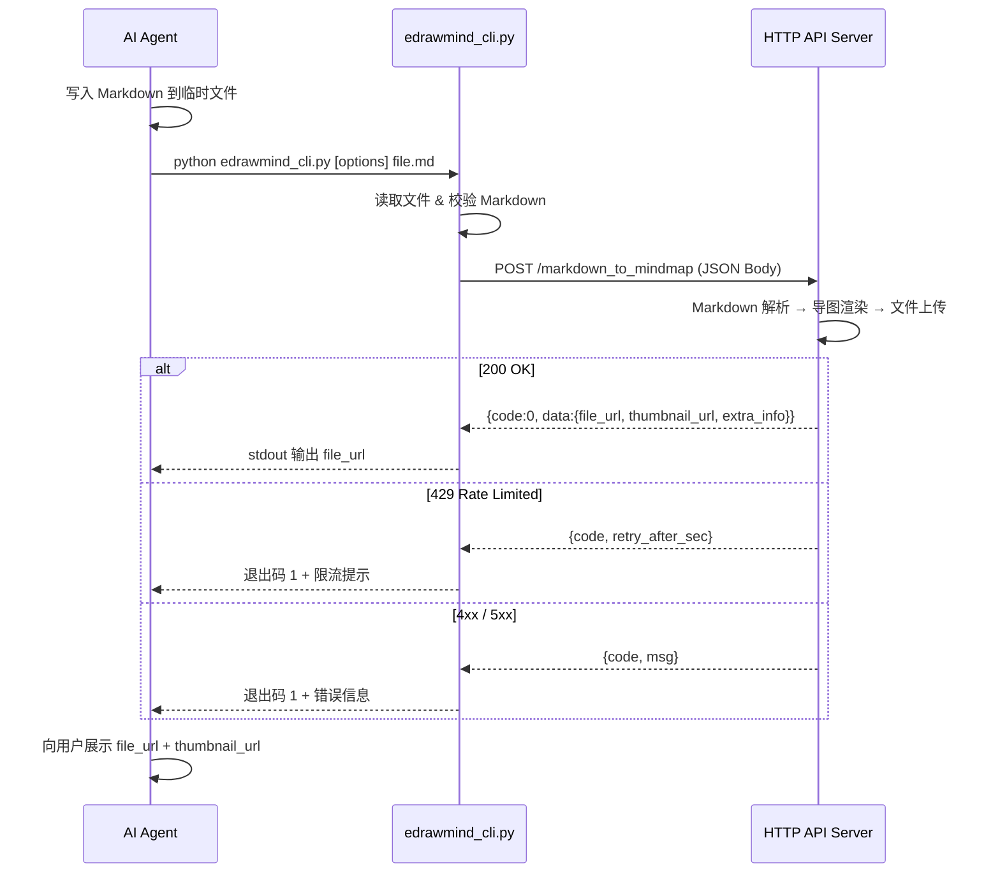
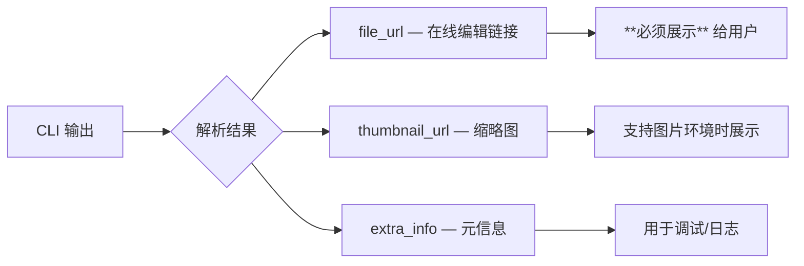
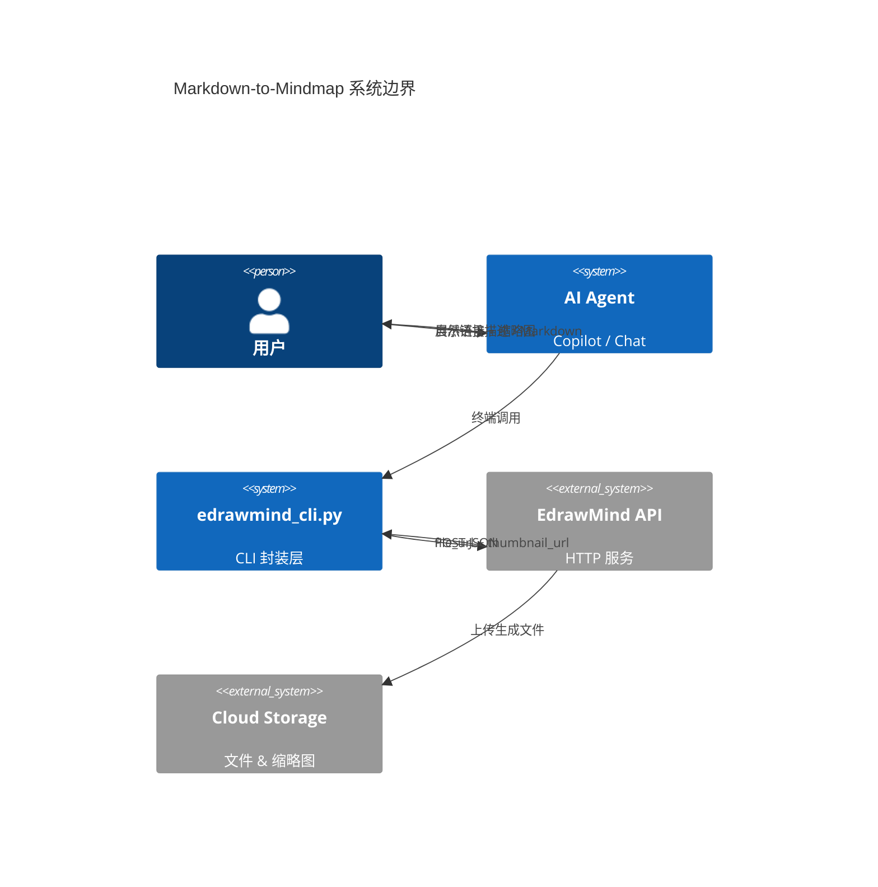

<!-- 开发参考文档 — 不随 SKILL 发布 -->

# Markdown-to-Mindmap 生成流程参考

> **Version** 1.0 · **Last Updated** 2026-03-17
> **Owner** EdrawMind AI Team · **Status** Active

本文档描述从用户输入到思维导图生成的完整处理流程，供开发团队理解系统行为和排障参考。

---

## 1. 端到端流程总览

---

## 2. 内容准备阶段

### 2.1 输入来源

| 来源 | 处理策略 |
|------|---------|
| Markdown 文件 | 直接读取 → 内容清洗 |
| 自然语言描述 | 根据主题生成 2–4 层 Markdown 大纲 |
| 代码库/项目结构 | 遍历目录树 → 按模块整理为 Markdown 层级 |

### 2.2 内容清洗规则

- **去除编号前缀**：`## 3.1 设计原则` → `## 设计原则`
- **精简标题**：节点文字中文 3–10 字，英文 3–5 词
- **单根节点**：仅保留一个 `#` 一级标题作为根节点
- **深度控制**：超过 5 层时尝试合并/拍平叶子节点
- **数量控制**：超过 80 节点时建议按章节拆分

### 2.3 校验规则

| 检查项 | 条件 | 失败行为 |
|--------|------|---------|
| 非空检查 | `text` 不为空 | 拒绝并提示 |
| 标题检查 | 至少包含一个 `#` 或 `##` 标题 | 拒绝并提示 |
| 列表检查 | 至少包含一个列表项（`-`/`*`/`+`/`1.`） | 拒绝并提示 |
| 数量预警 | 节点数 > 80 | 警告（不阻断） |

---

## 3. 参数推断阶段

当用户未显式指定样式参数时，系统根据内容语义自动推断。用户显式指定的参数始终优先。

### 3.1 推断决策树

### 3.2 参数搭配示例

| 场景 | `layout_type` | `theme_style` | `background` | 手绘 |
|------|:---:|:---:|:---:|------|
| 学习笔记 | 1 | 2 (Knowledge) | — | — |
| 项目里程碑 | 7 (Timeline) | 4 (Minimal) | 4 (晴空蓝) | — |
| 头脑风暴 | 1 | 5 (Rainbow) | — | — |
| 手绘素描 | 1 | 6 (Paper) | 9 (棉纸纹) | line + pencil |
| 技术架构 | 3 (RightTree) | 10 (SciFi) | 8 (碳黑) | — |
| 组织架构 | 5 (OrgDown) | 4 (Minimal) | 3 (暖奶白) | — |

---

## 4. 调用执行阶段

### 4.1 CLI 调用链路

### 4.2 CLI 参数与 API 字段映射

| CLI 参数 | API 字段 | 类型 | 约束 |
|---------|---------|------|------|
| `--layout N` | `layout_type` | int | 1–12 |
| `--theme N` | `theme_style` | int | 1–10 |
| `--background BG` | `background` | string | 1–15 或 `#RRGGBB` |
| `--line-hand-drawn` | `line_hand_drawn` | bool | — |
| `--fill STYLE` | `fill_hand_drawm` | string | 枚举值 |
| `--api-key KEY` | Header `X-API-Key` | string | — |
| `--insecure` | (SSL context) | — | 跳过证书验证 |

> `fill_hand_drawm` 字段名为上游历史拼写（缺少末尾 `n`），CLI 层自动处理映射。

---

## 5. 结果展示阶段

- `file_url` **必须** 展示给用户，这是使用契约的硬性要求
- `thumbnail_url` 在支持图片渲染的环境中展示预览
- `extra_info.request_id` 用于故障排查时关联服务端日志

---

## 6. 异常处理

| 异常类型 | 现象 | 处理策略 |
|---------|------|---------|
| Markdown 校验失败 | 无标题或无列表项 | 提示用户修正格式；可用 `--no-validate` 跳过 |
| SSL 证书错误 | 开发环境自签名证书 | 使用 `--insecure` 跳过验证 |
| HTTP 429 限流 | 请求频率超限 | 读取 `retry_after_sec`，等待后重试 |
| HTTP 500 服务端错误 | 渲染管线异常 | 记录 `request_id`，联系服务端团队 |
| 主题+布局兼容问题 | 部分组合偶发保存失败 | 更换主题编号后重试 |
| 网络连接失败 | DNS 解析或网络不可达 | 检查网络连通性和 API 端点地址 |

---

## 7. 架构边界

---

*Internal Reference — Wondershare EdrawMind © 2026*
